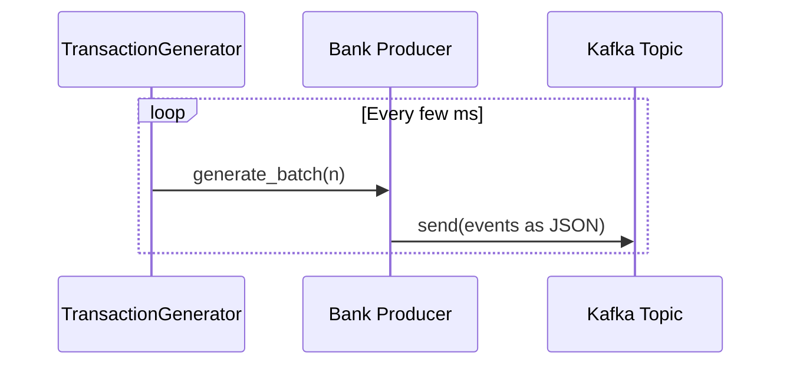

## Fraud Detection Streaming Pipeline (Kafka + Spark + Medallion + Streamlit)

This project simulates a **real-time fraud detection data platform** for multiple banks, built to be both **demo-friendly** and **production-inspired**.

It showcases:
- **Kafka-based ingestion** of synthetic banking transactions across channels (ATM, POS, Web, Mobile).
- A **Medallion architecture** (Bronze → Silver → Gold-ready) on top of **HDFS**.
- **Streaming ETL pipelines** using PySpark (quality checks, PII masking, schema harmonization).
- A **Streamlit dashboard** that reads directly from the medallion layers to visualize pipeline health and transformed data.

This README is intentionally **presentation-ready**: you can use it as a script when walking stakeholders through the architecture.

---

### Table of Contents

- **Overview**
- **High-Level Architecture**
- **End-to-End Data Flow (Narrative)**
- **Medallion Architecture**
- **ETL / Streaming Pipelines**
- **Data Schemas & Quality Rules**
- **Streamlit Dashboard**
- **Running the System**
- **Extending the Platform**

---

## Overview

**Goal**: Provide a realistic mini-platform that demonstrates how a bank could:
- Ingest **high-volume transactional events** from multiple channels via Kafka.
- Land **raw, immutable data** into a **Bronze** layer.
- Clean, standardize, and protect PII in a **Silver** layer.
- Route bad data into a **Dead Letter / Garbage** area for inspection.
- Power **interactive monitoring dashboards** without coupling to the producers.

**Key Technologies:**
- **Kafka**: Real-time event ingestion.
- **Spark Structured Streaming**: Continuous ETL and medallion orchestration.
- **HDFS**: Durable storage of Bronze/Silver/Garbage layers.
- **Streamlit**: Lightweight analytics/monitoring UI.
- **Docker / docker-compose**: Local orchestration.

---

## High-Level Architecture

Conceptually, the platform looks like this:

```mermaid
flowchart LR
    subgraph Banks_and_Channels
        TG[Transaction Generator] --> P_A[Bank A Producers]
        TG --> P_B[Bank B Producers]
        TG --> P_C[Bank C Producers]
    end

    P_A --> K[(Kafka Cluster)]
    P_B --> K
    P_C --> K

    K --> S1[Spark Job: Kafka to Bronze (HDFS)]
    S1 --> BZ[(Bronze Layer<br/>HDFS Parquet)]

    BZ --> S2[Spark Job: Bronze to Silver + Garbage]
    S2 --> SV[(Silver Layer<br/>HDFS Parquet)]
    S2 --> GB[(Garbage / Dead Letter<br/>HDFS JSON)]

    SV --> UI[Streamlit Dashboard UI]
    BZ --> UI
    GB --> UI
```

- **Generators** (`generators/transaction_generator.py`) fabricate realistic, sometimes dirty transactions.
- **Producers** (`producers/bank_*/..._producer.py`) push events to Kafka topics like `bank_a_transactions`.
- **Spark Job 1** (`spark_jobs/streaming_to_hdfs.py`) copies Kafka events into HDFS **Bronze**.
- **Spark Job 2** (`spark_jobs/bronze_to_silver.py`) parses, validates, masks, and routes to **Silver** and **Garbage**.
- **Dashboard** (`utils/dashboard.py`) reads Bronze/Silver/Garbage and visualizes the health of the pipeline.

---

## End-to-End Data Flow (From Ingestion to Dashboard)

### 1. Synthetic Transaction Generation

- The **`TransactionGenerator`** class (`generators/transaction_generator.py`) creates both:
  - **Valid events**: realistic amounts, timestamps, and card numbers.
  - **Dirty events**: missing fields, corrupted values, or extra unexpected fields.
- Each generated event has:
  - `bank_id` (e.g., `BANK_A`)
  - `channel` (e.g., `ATM`, `POS`, `WEB`, `MOBILE`)
  - `raw_payload` (nested JSON with transactional details)
  - `ingest_time`, `source_event_id`, and `extra_metadata` (e.g., `branch_id`, `device_status`)

### 2. Per-Bank Producers → Kafka

- For each bank (A, B, C) and channel, there is a dedicated producer:
  - `producers/bank_a/atm_producer.py`, `.../pos_producer.py`, `.../web_producer.py`, `.../mobile_producer.py`, and similarly for banks B and C.
- These producers:
  - Call `TransactionGenerator` to get events.
  - Serialize them as JSON.
  - Send to **Kafka topics** named like `bank_a_transactions`, `bank_b_transactions`, etc.

Conceptually:



### 3. Kafka → HDFS Bronze (Raw Ingestion)

Handled by `spark_jobs/streaming_to_hdfs.py`:

- Subscribes to **all bank topics** using a pattern: `bank_.*_transactions`.
- Reads from Kafka with **Structured Streaming**, then:
  - Casts `key` and `value` to strings.
  - Stores `value` as `raw_payload` (a **string** of JSON).
  - Keeps Kafka metadata (`topic`, `partition`, `offset`, `ingest_time`).
- Writes this as **Parquet** to:
  - `hdfs://namenode:8020/fraud_detection/bronze/transactions`

**Key design choice**: Bronze is **raw & schema-on-read** – the JSON is not fully parsed here. This keeps Bronze **simple, cheap, and immutable**, and pushes transformation logic downstream to Silver.

### 4. Bronze → Silver + Garbage (Harmonization & Quality)

Handled by `spark_jobs/bronze_to_silver.py` with help from `spark_jobs/schemas.py`:

- Reads from the Bronze parquet folder using `bronze_read_schema`.
- Parses the `raw_payload` JSON into a structured `bronze_transaction_schema`:
  - Fields like `atmCode`, `trxAmt`, `trxTime`, `cardNumber`, plus metadata (`branch_id`, `device_status`).
- Harmonizes into a **standardized Silver schema**:
  - `transaction_id`, `event_timestamp`, `bank_id`, `channel`, `amount`, `masked_card`, `status`, `quality_score`, `processed_at`.
- Applies **quality rules**:
  - Missing `amount` → `quality_score = "MISSING_AMOUNT"`.
  - Negative `amount` → `quality_score = "INVALID_VALUE"`.
  - `device_status == "WARN"` → `quality_score = "DEVICE_WARNING"`.
  - Otherwise → `quality_score = "CLEAN"`.
- Applies **PII masking**:
  - `card_number` is hashed using `sha2(..., 256)` into `masked_card`.
- Splits into two streaming sinks:
  - **Silver (clean)**:
    - Filter `quality_score == "CLEAN"`.
    - Write Parquet to `.../silver/transactions`, partitioned by `bank_id`, `channel`.
  - **Garbage (dead letter)**:
    - Filter `quality_score != "CLEAN"`.
    - Write JSON to `.../garbage/rejected`.

### 5. Streamlit Dashboard → Observability

The dashboard in `utils/dashboard.py`:

- Initializes a **SparkSession** inside Streamlit (with smart path detection for Spark libraries).
- Reads:
  - `bronze` = Parquet from `.../bronze/transactions`
  - `silver` = Parquet from `.../silver/transactions`
  - `garbage` = JSON from `.../garbage/rejected` (if it exists)
- Provides:
  - **Global filters** (e.g., select specific banks).
  - **KPI metrics**: total records, active banks, layer status, etc.
  - **Transformation journey**: comparison of original values vs masked/standardized ones.
  - **Bank traffic distribution**: pie chart of transaction counts per bank.
  - **Schema canonization view**: how different raw schemas collapse into a single Silver schema.
  - **Layer tabs**:
    - Bronze (Raw Kafka payloads).
    - Silver (Cleaned & partitioned).
    - Garbage (Rejected events for quality audit).

This is effectively the **“single pane of glass”** for demoing the pipeline.

---

## Medallion Architecture

Even though the current implementation focuses primarily on **Bronze** and **Silver**, the structure is **Gold-ready**.

```mermaid
graph TD
    subgraph Storage_Layout
        BZ[Bronze<br/>Raw Kafka payloads<br/>schema-on-read] --> SV[Silver<br/>Clean, standardized<br/>PII-masked]
        SV --> GD[Gold (Future)<br/>Curated, business-ready<br/>aggregates & features]
        SV --> GB[Garbage / DLO<br/>Rejected & bad records]
    end
```

- **Bronze**:
  - Raw, append-only, minimal assumptions.
  - Keeps original Kafka metadata and `raw_payload` JSON.
  - Enables **replay** and **reprocessing** with new rules.

- **Silver**:
  - Parsed, cleaned, and conformant schema.
  - PII masked (`masked_card`) and currency/amount types normalized.
  - Partitioned by `bank_id` and `channel` for efficient downstream queries.

- **Gold (future extension)**:
  - Could contain:
    - Fraud scores per transaction.
    - Aggregated KPIs (per bank/channel/time window).
    - Features for ML models (e.g., rolling averages, velocity checks).

- **Garbage / Dead Letter**:
  - Captures all non-conformant records.
  - Provides **auditability** and **data quality observability**.

---

## ETL / Streaming Pipelines in Detail

### 1. Kafka → Bronze ETL (Streaming)

- **Input**: Kafka topics `bank_.*_transactions`.
- **Tooling**: Spark Structured Streaming (`spark_jobs/streaming_to_hdfs.py`).
- **Transformations**:
  - Cast Kafka `value` to string and store as `raw_payload`.
  - Add ingest metadata (`topic`, `partition`, `offset`, `ingest_time`).
- **Sink**:
  - Parquet files in HDFS (`bronze/transactions`) with 5-second micro-batches.

### 2. Bronze → Silver ETL (Streaming)

- **Input**: Bronze Parquet + schemas (`schemas.py`).
- **Transformations**:
  - Parse JSON payload into strongly-typed columns.
  - Normalize & map fields to a common schema.
  - Apply quality rules and assign a `quality_score`.
  - Mask sensitive fields (card numbers) with SHA-256.
  - Harmonize timestamps into `event_timestamp`.
- **Dual Sinks**:
  - **Silver** (clean) Parquet, partitioned by bank and channel.
  - **Garbage** JSON for bad/outlier records.

### 3. Silver → Dashboard (Batch/On-Demand)

- **Input**: Silver & Bronze & Garbage locations in HDFS.
- **Tooling**: Streamlit + SparkSession (`utils/dashboard.py`).
- **Transformations**:
  - Filter by banks and channels selected in UI.
  - Compute simple metrics and distribution charts.
  - Display tabular views and schema comparison.

---

## Data Schemas & Quality Rules

### Bronze Read Schema (HDFS-facing)

At HDFS level, Bronze stores data using a lightweight schema (`bronze_read_schema`):

- `key`: string
- `raw_payload`: string (JSON)
- `topic`: string
- `partition`: string
- `offset`: string
- `ingest_time`: timestamp

This enables:
- High-ingest throughput.
- Schema evolution at the edges.
- Deferred parsing until Silver.

### Parsed Bronze / Silver Logical Schema

After parsing `raw_payload`, the **logical structure** from `bronze_transaction_schema` and Silver looks like:

- `transaction_id`: unique identifier per event.
- `bank_id`: standardized bank code.
- `channel`: acquisition channel (ATM, POS, WEB, MOBILE).
- `amount`: double.
- `masked_card`: SHA-256 hash of the card number.
- `event_timestamp`: normalized event time.
- `status`: device or channel status.
- `quality_score`: one of `CLEAN`, `MISSING_AMOUNT`, `INVALID_VALUE`, `DEVICE_WARNING`, etc.
- `processed_at`: ingestion time into Silver.

### Quality Rules (Examples)

- **Completeness**: `amount` must not be null.
- **Validity**: `amount` must be non-negative.
- **Operational health**: `device_status` influences `quality_score`.
- **PII protection**: Raw card numbers should **never appear** in Silver; only `masked_card`.

---

## Streamlit Dashboard (User Experience)

The dashboard is designed to also serve as a **demo artifact**:

- **Landing Page**:
  - Title: *Real-Time Fraud Pipeline Monitor*.
  - Global metrics (total records, active banks, layer status, security).

- **Tabs**:
  - **Comparison & Metrics**:
    - KPI cards for pipeline health.
    - Table showing *before vs after* for selected Silver fields (e.g., amount, masked card).
    - Bank traffic distribution pie chart.
    - Schema canonization table (how different raw fields from each bank map into unified Silver fields).
  - **Bronze (Raw)**:
    - Sample of raw Bronze data with JSON payload.
  - **Silver (Cleaned)**:
    - Filterable Silver dataset by bank.
  - **Garbage (Dead Letter Office)**:
    - If garbage exists: show all rejected events with their structure for forensic analysis.
    - If not: show a “0 rejected” healthy pipeline message.

For presentations, you can:
- Start at the **top metrics** to show overall volume and health.
- Move to the **schema canonization** section to emphasize standardization across banks.
- Conclude on the **Garbage tab** to highlight data quality governance.

---

## Running the System

> Note: Exact commands may depend on your local environment. This section is meant as a high-level playbook for demoing the system.

### 1. Prerequisites

- Docker & docker-compose installed.
- Adequate resources (e.g., 4+ vCPUs, 8+ GB RAM) for Kafka + Spark + Streamlit.

### 2. Bring Up the Infrastructure

- Use `docker-compose.yml` (if provided/extended) to start:
  - Zookeeper + Kafka.
  - Spark (namenode / datanode or Spark cluster containers).
  - Streamlit app.

Example (conceptual) commands:

```bash
docker-compose up -d  # start Kafka, Spark, and Streamlit services
```

### 3. Start the Streaming Jobs

Inside the Spark container(s), run:

```bash
# 1. Kafka → HDFS Bronze
spark-submit spark_jobs/streaming_to_hdfs.py

# 2. Bronze → Silver + Garbage
spark-submit spark_jobs/bronze_to_silver.py
```

These jobs will keep running as **long-lived streaming applications**.

### 4. Start Data Production

Run the producers (either from containers or locally, depending on your setup):

```bash
python pipelines/run_pipeline.py  # orchestrates producers for all banks/channels
```

This will continuously generate and send transactions for banks A, B, and C.

### 5. Open the Dashboard

Once the Streamlit service is running (as defined in your Docker setup), open the app in your browser (for example):

```text
http://localhost:8501
```

You should see the **Fraud Pipeline Monitor** with data flowing in as the Spark jobs and producers run.

---

## Extending the Platform

This project is intentionally modular so you can extend it for more advanced demos or real-world scenarios.

- **Add a new bank**:
  - Create new producers under `producers/bank_d/`.
  - Update configurations in `config/` as needed.
  - Ensure the Silver schema and mappings still apply (or extend them).

- **Introduce a Gold layer**:
  - Create new Spark jobs that:
    - Read from Silver.
    - Compute aggregates and fraud risk scores.
    - Write to a `gold/` directory.
  - Extend the Streamlit app to read Gold tables for executive dashboards.

- **Integrate ML**:
  - Use Silver as a **feature store**.
  - Train supervised models on historical labeled fraud/non-fraud transactions.
  - Deploy a scoring job that enriches Silver or Gold with `fraud_score` columns.

- **Enhance Data Quality**:
  - Add more rules (e.g., velocity checks, logical consistency across fields).
  - Generate alerts when Garbage rate exceeds a threshold.

---


